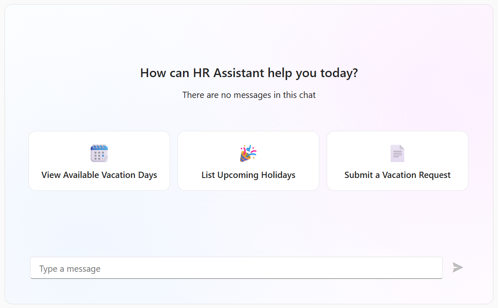

<!-- default badges list -->

<!-- default badges end -->
# DevExtreme Chat - Empty View Customization

This example configures custom markup used for empty view within the DevExtreme Chat component.

To configure the Chat empty view, specify the [emptyViewTemplate](https://js.devexpress.com/Documentation/ApiReference/UI_Components/dxChat/Configuration/#emptyViewTemplate) property. This example integrates the DevExtreme [TileView](https://js.devexpress.com/Documentation/Guide/UI_Components/TileView/Overview/) component within the empty view container. The **texts**.**message** variable defined in the **emptyViewTemplate** parameter is also implemented.

## Files to Review

- **Angular**
    - [app.component.html](Angular/src/app/app.component.html)
    - [app.component.ts](Angular/src/app/app.component.ts)
- **React**
    - [App.tsx](React/src/App.tsx)
- **Vue**
    - [App.vue](Vue/src/App.vue)
    - [Home.vue](Vue/src/components/HomeContent.vue)
- **jQuery**
    - [index.html](jQuery/src/index.html)
    - [index.js](jQuery/src/index.js)

## Documentation

- [DevExtreme Chat - Customize the Empty View](https://js.devexpress.com/Documentation/Guide/UI_Components/Chat/Customize_the_Empty_View/)
- [emptyViewTemplate](https://js.devexpress.com/Documentation/ApiReference/UI_Components/dxChat/Configuration/#emptyViewTemplate)

<!-- feedback -->
## Does this example address your development requirements/objectives?

 

(you will be redirected to DevExpress.com to submit your response)
<!-- feedback end -->
